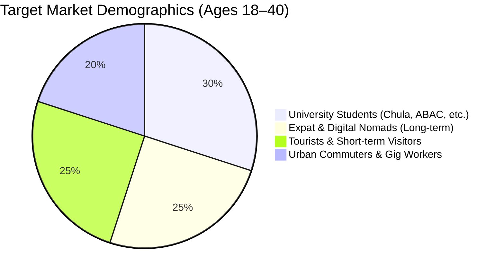
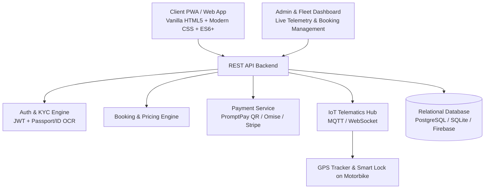
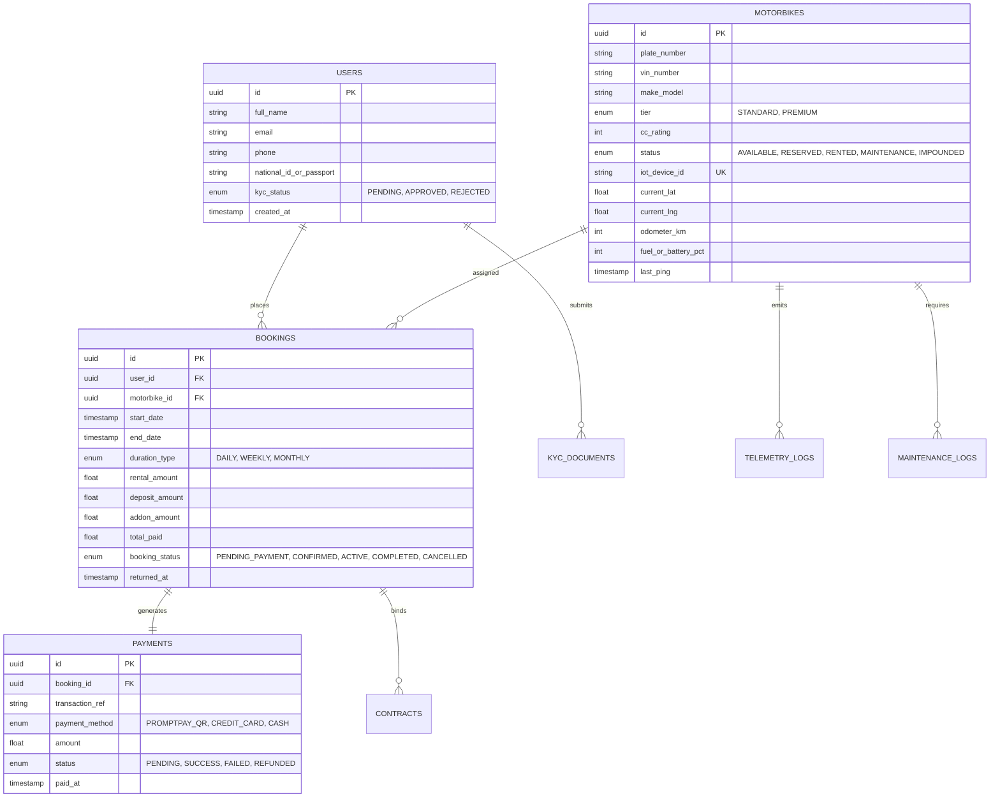
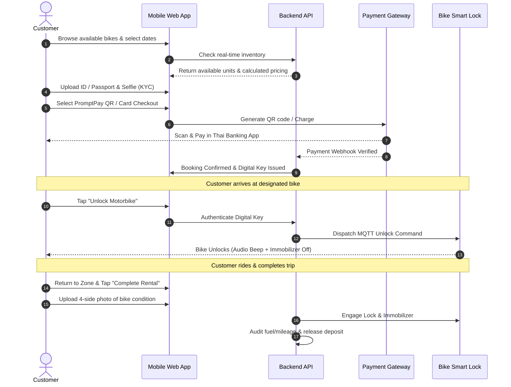
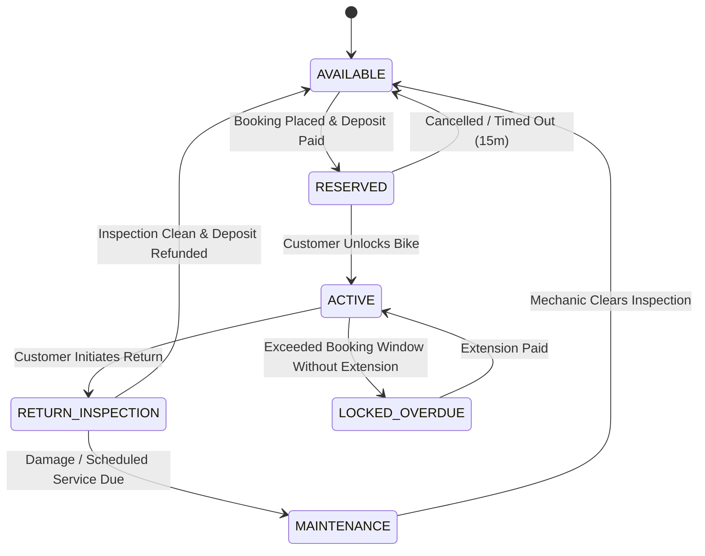
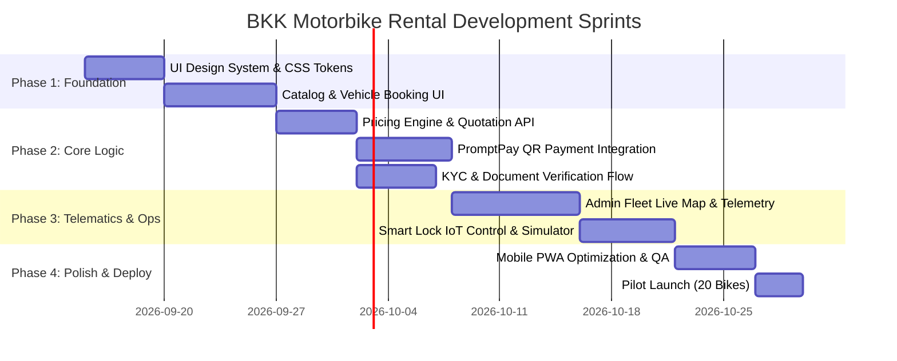

# BKK Motorbike Rental — System Analysis & Technical Blueprint

> **Document Version:** 1.0.0  
> **Last Updated:** September 2026  
> **Target Platform:** Mobile-First Web Application & Admin Fleet Dashboard  
> **Reference Benchmark:** `Docs/Digital_Business_Project_FitBite.pptx` & `Docs/BKK Motorbike Rental.pdf`

---

## Table of Contents
1. [Executive Summary & Product Objectives](#1-executive-summary--product-objectives)
2. [Reference Benchmark & Competitor Audit (MadBike.co)](#2-reference-benchmark--competitor-audit-madbikeco)
3. [Target Audience & User Personas](#3-target-audience--user-personas)
4. [Core Business Logic & Pricing Engine](#4-core-business-logic--pricing-engine)
5. [Financial Model & Unit Economics](#5-financial-model--unit-economics)
6. [System Architecture & Tech Stack](#6-system-architecture--tech-stack)
7. [Data Models & Database Schema](#7-data-models--database-schema)
8. [User Journeys & State Machines](#8-user-journeys--state-machines)
9. [API Specifications & Endpoints](#9-api-specifications--endpoints)
10. [UI/UX Structure & Component Inventory (Inspired by MadBike.co)](#10-uiux-structure--component-inventory-inspired-by-madbikeco)
11. [IoT & GPS Smart Lock Architecture](#11-iot--gps-smart-lock-architecture)
12. [Legal, PDPA & Security Compliance](#12-legal-pdpa--security-compliance)
13. [Implementation Roadmap & Milestones](#13-implementation-roadmap--milestones)

---

## 1. Executive Summary & Product Objectives

### 1.1 Problem Statement
Traditional motorbike rentals in Bangkok face significant operational and customer frictions:
- **Physical Dependency:** Customers must visit physical shops to check availability.
- **Opacity:** Unclear pricing, hidden insurance fees, arbitrary deposit deductions, and ambiguous vehicle condition logs.
- **Inefficient Operations:** Paper contracts, manual passport/deposit handling, high risk of theft or unauthorized cross-border travel.

### 1.2 Digital Solution
**BKK Motorbike Rental** is an end-to-end digital mobility platform connecting urban commuters, students, expats, and tourists with a smart-managed fleet (initial 20-bike fleet: 10 Standard, 10 Premium):
- Real-time catalog search with instant availability and transparent tier pricing.
- Digital identity verification (KYC) and contactless digital rental agreements.
- Thai QR (PromptPay), credit/debit card, and e-wallet payments.
- IoT-enabled smart locks, live GPS telemetry, geofencing, and automated fleet maintenance scheduling.

---

## 2. Reference Benchmark & Competitor Audit (MadBike.co)

### 2.1 MadBike.co Architecture & Workflow Overview
[MadBike](https://madbike.co/) is an established Bangkok motorcycle rental operator. An audit of their platform reveals the core features that customers expect:

| MadBike.co Feature | MadBike Implementation | BKK Motorbike Rental Enhancement (Our Edge) |
| :--- | :--- | :--- |
| **Fleet Categories** | Economy (Scoopy), Standard (Click/Filano), Premium (Aerox/NMAX) | **Tiered Fleet:** Standard (Click 125/160, Scoopy) & Premium (Forza 350, XMAX 300, Vespa Sprint) |
| **Booking Flow** | Static contact form / WhatsApp inquiry | **Instant Interactive Booking:** Live availability calendar + Instant checkout |
| **Payments** | Cash, Card at shop, Manual bank transfer | **Instant Digital Payments:** Automated PromptPay QR code + Stripe/Omise Card Gateway |
| **Identity / KYC** | In-person passport copies & paper contracts | **Digital KYC Engine:** In-app photo ID/Passport upload + automated digital rental contract |
| **Bike Handover** | In-person key exchange at station or door | **Smart IoT Keyless Access:** In-app remote unlock/lock + GPS geofencing & telemetry |
| **Referral Program** | THB 500 friend referral discount | **Integrated Referral System:** Automated referral voucher codes + in-app credit balance |
| **Customer Support** | Floating WhatsApp, LINE, Phone buttons | **Omnichannel Support:** In-app live chat + LINE Official Account webhook + Emergency hotline |

### 2.2 Benchmarked Price Comparison (THB)

```
Daily / Weekly / Monthly Benchmark Comparison
┌──────────────┬────────────────────────────┬─────────────────────────────┐
│ Category     │ MadBike.co Rates           │ BKK Motorbike Rental Rates  │
├──────────────┼────────────────────────────┼─────────────────────────────┤
│ Economy/Std  │ ฿300 - ฿350 / Day          │ ฿300 / Day                  │
│              │ ฿1,500 - ฿1,700 / Week     │ ฿1,900 / 7 Days             │
│              │ ฿3,000 - ฿3,500 / Month    │ ฿5,500 / 30 Days            │
├──────────────┼────────────────────────────┼─────────────────────────────┤
│ Premium/Maxi │ ฿500 / Day (155cc NMAX)    │ ฿450 / Day (300cc-350cc)    │
│              │ ฿2,500 / Week              │ ฿2,800 / 7 Days             │
│              │ ฿5,500 / Month             │ ฿9,500 / 30 Days (Forza)    │
└──────────────┴────────────────────────────┴─────────────────────────────┘
```

---

## 3. Target Audience & User Personas



| Persona | Key Needs | Preferred Tier | Typical Duration |
| :--- | :--- | :--- | :--- |
| **Alex (Expat Professional)** | Reliable daily commute, avoid BTS rush hour, hassle-free monthly maintenance. | Premium (Forza/XMAX) | 30 Days (Recurring) |
| **Somchai (University Student)** | Low-cost transit between condo and campus, split payments, easy mobile booking. | Standard (Click/Scoopy) | 7 to 30 Days |
| **Liam & Mia (Tourists)** | Transparent deposit, instant rental near airport/hotel, GPS security, English UI. | Standard / Premium | 1 to 7 Days |

---

## 4. Core Business Logic & Pricing Engine

### 4.1 Vehicle Fleet Categorization

```
Fleet (20 Units)
├── Standard Tier (10 Units)
│   ├── Honda Click 125cc / 160cc
│   ├── Yamaha Scoopy-i 110cc
│   └── Honda Lead 125cc
└── Premium Tier (10 Units)
    ├── Honda Forza 350cc
    ├── Yamaha XMAX 300cc
    └── Vespa Sprint / Primavera 150cc
```

### 4.2 Pricing Matrix & Margin Calculations

| Tier | Duration | Customer Price (THB) | Variable Cost (THB) | Contribution Margin (THB) | Margin % |
| :--- | :--- | :--- | :--- | :--- | :--- |
| **Standard** | 1 Day | ฿300 | ฿100 | ฿200 | 66.7% |
| **Standard** | 7 Days | ฿1,900 | ฿600 | ฿1,300 | 68.4% |
| **Standard** | 30 Days | ฿5,500 | ฿2,000 | ฿3,500 | 63.6% |
| **Premium** | 1 Day | ฿450 | ฿150 | ฿300 | 66.7% |
| **Premium** | 7 Days | ฿2,800 | ฿900 | ฿1,900 | 67.8% |
| **Premium** | 30 Days | ฿9,500 | ฿3,500 | ฿6,000 | 63.1% |

### 4.3 Dynamic Add-ons & Deposit Logic
- **Refundable Security Deposit:**
  - Standard Tier: `฿1,000` (Domestic ID) / `฿2,000` (Passport)
  - Premium Tier: `฿3,000` (Domestic ID) / `฿5,000` (Passport)
- **Optional Add-ons:**
  - Premium Helmet (Full Face / Bluetooth Intercom): `฿50/day`
  - Zero-Deductible Damage Waiver: `฿80/day` (Standard) / `฿150/day` (Premium)
  - Mobile Phone Mount & Rain Cover: `Free` / Included
  - Doorstep Delivery & Return (within 15km): `฿200` flat

---

## 5. Financial Model & Unit Economics

### 5.1 Fixed Cost Breakdown (฿168,000 / month)

```
Monthly Fixed Costs (฿168,000 Total)
├── Staff Salaries (Operations/Mechanic/Support): ฿80,000 (47.6%)
├── Motorcycle Financing (20 Units): ฿30,000 (17.9%)
├── Office & Storage Yard Rent: ฿20,000 (11.9%)
├── Commercial Fleet Insurance: ฿15,000 (8.9%)
├── Marketing, Ads & Influencers: ฿5,000 (3.0%)
├── Emergency Contingency: ฿5,000 (3.0%)
├── Admin & Office Overhead: ฿4,000 (2.4%)
├── Software / App Hosting / SaaS: ฿3,000 (1.8%)
├── GPS / IoT SIM Cards & Telematics: ฿3,000 (1.8%)
└── Licensing, Permits & Legal: ฿3,000 (1.8%)
```

### 5.2 Break-Even & Profitability Simulation

$$\text{Break-Even Revenue} = \frac{\text{Fixed Costs}}{\text{Average Contribution Margin Ratio (\%)}}$$

Given an average contribution margin of **66.5%**:
$$\text{Break-Even Monthly Revenue} \approx \frac{168,000}{0.665} \approx \mathbf{฿252,631}$$

#### Monthly Fleet Utilization Scenario (20 Bikes × 30 Days = 600 Available Days)

| Utilization Level | Blended Revenue | Total Variable Cost | Total Fixed Cost | Net Operating Profit |
| :--- | :--- | :--- | :--- | :--- |
| **60% Utilization** | ฿185,000 | ฿62,000 | ฿168,000 | **-฿45,000** (Loss) |
| **75% Utilization** | ฿255,000 | ฿85,000 | ฿168,000 | **+฿2,000** (Break-Even) |
| **85% Target Utilization** | ฿315,000 | ฿105,000 | ฿168,000 | **+฿42,000** (Healthy) |
| **95% Peak Season** | ฿380,000 | ฿126,000 | ฿168,000 | **+฿86,000** (High Profit) |

---

## 6. System Architecture & Tech Stack



### Recommended Technology Stack
- **Frontend:** Vanilla CSS (Glassmorphism, Dark/Light theme, Modern CSS Tokens), ES6 JavaScript Modules, Progressive Web App (PWA) manifest for instant mobile install without App Store friction.
- **Backend (API):** Node.js (Express / Fastify) or Next.js / Serverless API routes.
- **Database:** PostgreSQL / Supabase or SQLite (with Prisma ORM) for ACID transactional integrity on bookings and payments.
- **IoT Protocols:** MQTT / HTTP Webhooks for GPS coordinates, battery voltage, and lock/unlock commands.
- **Payments:** Omise / 2C2P / Stripe Thailand supporting PromptPay QR code generation and instant webhook payment confirmation.

---

## 7. Data Models & Database Schema



---

## 8. User Journeys & State Machines

### 8.1 Customer Rental Lifecycle



### 8.2 Vehicle Fleet State Machine



---

## 9. API Specifications & Endpoints

### 9.1 Authentication & KYC
- `POST /api/v1/auth/otp-request` — Request SMS/Email OTP.
- `POST /api/v1/auth/otp-verify` — Verify token & establish session.
- `POST /api/v1/kyc/upload` — Upload driver's license/passport + selfie.
- `GET /api/v1/kyc/status` — Check verification approval state.

### 9.2 Inventory & Pricing
- `GET /api/v1/vehicles?tier=STANDARD&available_from=2026-09-15&available_to=2026-09-22` — Query active catalog.
- `GET /api/v1/vehicles/:id` — Detail view, specs, high-res photos, battery/fuel status.
- `POST /api/v1/pricing/quote` — Dynamic price calculation (Duration + Add-ons + Deposit - Discounts).

### 9.3 Booking & Transactions
- `POST /api/v1/bookings` — Create pending reservation lock (15-minute TTL).
- `POST /api/v1/bookings/:id/payment` — Generate PromptPay QR payload or Stripe intent.
- `POST /api/v1/webhooks/payment` — Inbound webhook for asynchronous payment clearance.
- `POST /api/v1/bookings/:id/extend` — Request rental extension.

### 9.4 Telematics & Smart Vehicle Control
- `POST /api/v1/vehicles/:id/unlock` — Authorize active renter to unlock vehicle.
- `POST /api/v1/vehicles/:id/lock` — Secure vehicle & engage immobilizer.
- `GET /api/v1/vehicles/:id/telemetry` — Live GPS position, speed, and geofence boundary.

---

## 10. UI/UX Structure & Component Inventory (Inspired by MadBike.co)

```
UI Application Architecture
├── Client Web App (Mobile-First RWD)
│   ├── Navigation Bar (Brand, Language Switcher EN/TH, User Profile)
│   ├── Hero Section (Quick search bar: Dates, Pickup Hub, Bike Tier)
│   ├── Vehicle Catalog Grid (Card components with 3D-like glass cards, specs badges)
│   ├── Interactive Booking Modal (Date picker, Tier switcher, Add-on toggles)
│   ├── KYC Onboarding Flow (Document dropzone, Camera preview)
│   ├── Payment Modal (PromptPay dynamic QR code with live timer & auto-refresh)
│   ├── Active Ride HUD (Smart Lock controller button, Trip odometer, Emergency Help)
│   └── Rental History & Invoicing (PDF receipt download)
└── Admin Operations Dashboard
    ├── Fleet Live Map View (Interactive Leaflet/Mapbox with color-coded bike markers)
    ├── Vehicle Management Table (Filter by status, trigger remote lock, maintenance logs)
    ├── Financial Analytics Cards (Daily Revenue, Monthly MRR, Fleet Utilization Rate)
    └── Maintenance & Incident Tracker
```

---

## 11. IoT & GPS Smart Lock Architecture

```
[4G / GPS Telematics Unit on Bike]
   │ (Encrypted MQTT over TLS)
   ▼
[AWS IoT Core / EMQX MQTT Broker]
   │
   ▼
[Backend Webhook Dispatcher]
   ├── Geo-fence Alert Handler (Triggers warning if bike exits Bangkok perimeter)
   ├── Battery Voltage Monitor (Alerts when 12V battery drops < 11.8V)
   └── Remote Immobilizer Controller (Restricts ignition if flagged stolen/unpaid)
```

### Safety & Anti-Theft Protocols
1. **Geofencing:** Automated boundary alerts if the vehicle leaves the Greater Bangkok Area without prior long-distance authorization.
2. **Speed & Tilt Sensors:** Instant push notification to operations if a stationary vehicle is tilted, moved, or lifted onto a truck.
3. **Safe Immobilization:** Engine kill commands are queued and execute only when telemetry confirms the vehicle speed is `0 km/h` to prevent accident liability.

---

## 12. Legal, PDPA & Security Compliance

1. **Thailand PDPA (Personal Data Protection Act):**
   - Encrypted storage of passport, Thai ID card, and driver's license scans.
   - Watermarking uploaded identification documents (*"For BKK Motorbike Rental Verification Only"*).
   - Clear opt-in consent for telemetry and GPS tracking during active rental periods.
2. **Department of Land Transport (DLT) Regulations:**
   - Mandatory check for valid Thai Driver's License or International Driving Permit (1949/1968 Geneva/Vienna Convention).
   - Mandatory Compulsory Motor Insurance (Por Ror Bor) policy documents embedded digitally in the app.

---

## 13. Implementation Roadmap & Milestones



---

*This document serves as the single source of truth for engineering, product, and business logic execution.*
